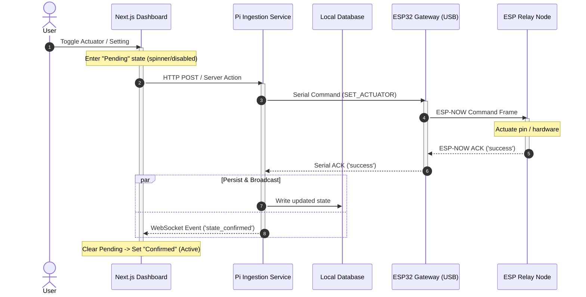

### Actuator Control and State Ackknowledgement Flow

```mermaid
sequenceDiagram
    autonumber
    actor User
    participant UI as Next.js Dashboard
    participant Server as Pi Ingestion Service
    participant DB as Local Database
    participant GW as ESP32 Gateway (USB)
    participant Node as ESP Relay Node

    User->>UI: Toggle Actuator / Setting
    activate UI
    Note over UI: Enter "Pending" state (spinner/disabled)
    
    UI->>Server: HTTP POST / Server Action
    activate Server
    Server->>GW: Serial Command (SET_ACTUATOR)
    activate GW
    
    GW->>Node: ESP-NOW Command Frame
    activate Node
    Note over Node: Actuate pin / hardware
    Node-->>GW: ESP-NOW ACK ('success')
    deactivate Node
    
    GW-->>Server: Serial ACK ('success')
    deactivate GW
    
    par Persist & Broadcast
        Server->>DB: Write updated state
    and
        Server-->>UI: WebSocket Event ('state_confirmed')
    end
    deactivate Server
    
    Note over UI: Clear Pending -> Set "Confirmed" (Active)
    deactivate UI
```